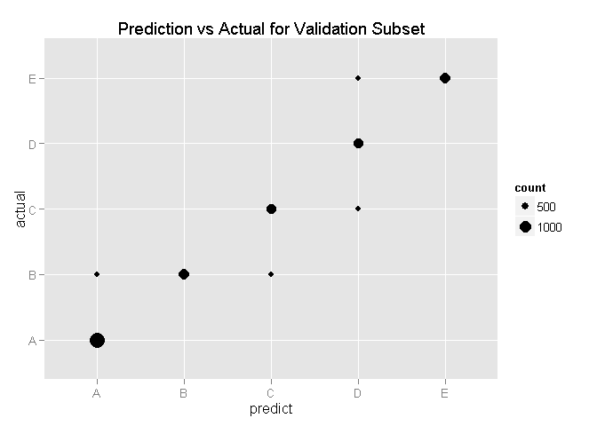

# PML-Project
Shereen Jones  
August 23, 2015  


## Background

Using devices such as Jawbone Up, Nike FuelBand, and Fitbit it is now possible to collect a large amount of data about personal activity relatively inexpensively. These type of devices are part of the quantified self movement - a group of enthusiasts who take measurements about themselves regularly to improve their health, to find patterns in their behavior, or because they are tech geeks. One thing that people regularly do is quantify how much of a particular activity they do, but they rarely quantify how well they do it. In this project, your goal will be to use data from accelerometers on the belt, forearm, arm, and dumbell of 6 participants. They were asked to perform barbell lifts correctly and incorrectly in 5 different ways. 

## The Data
The training data for this project are available here: 
     https://d396qusza40orc.cloudfront.net/predmachlearn/pml-training.csv
The test data are available here: 
     https://d396qusza40orc.cloudfront.net/predmachlearn/pml-testing.csv

## Load Libraries to be used in this exercise

```r
library (ggplot2)
library (caret)
```

```
## Warning: package 'caret' was built under R version 3.2.1
```

```
## Loading required package: lattice
```

```r
library (plyr)
library (dplyr)
```

```
## Warning: package 'dplyr' was built under R version 3.2.1
```

```
## 
## Attaching package: 'dplyr'
## 
## The following objects are masked from 'package:plyr':
## 
##     arrange, count, desc, failwith, id, mutate, rename, summarise,
##     summarize
## 
## The following objects are masked from 'package:stats':
## 
##     filter, lag
## 
## The following objects are masked from 'package:base':
## 
##     intersect, setdiff, setequal, union
```

```r
library (gridExtra)
```

```
## Loading required package: grid
```

```r
library (downloader)
library (gbm)
```

```
## Warning: package 'gbm' was built under R version 3.2.2
```

```
## Loading required package: survival
## 
## Attaching package: 'survival'
## 
## The following object is masked from 'package:caret':
## 
##     cluster
## 
## Loading required package: splines
## Loading required package: parallel
## Loaded gbm 2.1.1
```

```r
library (rattle)
```

```
## Warning: package 'rattle' was built under R version 3.2.2
```

```
## Loading required package: RGtk2
```

```
## Warning: package 'RGtk2' was built under R version 3.2.2
```

```
## Rattle: A free graphical interface for data mining with R.
## Version 3.5.0 Copyright (c) 2006-2015 Togaware Pty Ltd.
## Type 'rattle()' to shake, rattle, and roll your data.
```

```r
library (randomForest)
```

```
## Warning: package 'randomForest' was built under R version 3.2.2
```

```
## randomForest 4.6-10
## Type rfNews() to see new features/changes/bug fixes.
## 
## Attaching package: 'randomForest'
## 
## The following object is masked from 'package:dplyr':
## 
##     combine
```

## Get the Data
The files - a training file and a testing file - will be downloaded if they do not already exist in the working directory. After which the files will be loaded.


```r
fn1 <- "pml-training.csv"
URL1 <- "https://d396qusza40orc.cloudfront.net/predmachlearn/pml-training.csv"
if (!file.exists(fn1)) {
     download.file (URL1, fn1, method="wininet")
}

fn2 <- "pml-testing.csv"
URL2 <- "https://d396qusza40orc.cloudfront.net/predmachlearn/pml-testing.csv"
if (!file.exists(fn2)) {
     download.file (URL2, fn2, method="wininet")
}

traindata <- read.csv(fn1)
testdata <- read.csv(fn2)
```

## Split the training data into two data sets for training and validation purposes

```r
inTrain2 <- createDataPartition(y=traindata$classe, p=0.75, list=FALSE)
traintrain <- traindata[inTrain2,]
traintest <- traindata[-inTrain2,]
```

## Clean up the datasets

The first transformation will be to remove near zero variance variables

```r
nzv <- nearZeroVar(traindata)
## Apply transformation to all datasets
traintrain <- traintrain[, -nzv]
traintest <- traintest[, -nzv]
testdata <- testdata[, -nzv]
```

The second transformation will be to remove the high NA threshold variables


```r
highNA <- sapply(traintrain, function(x) mean(is.na(x))) > 0.95
## Apply transformation to all datasets
traintrain <- traintrain[, highNA==FALSE]
traintest <- traintest[, highNA==FALSE]
testdata <- testdata[, highNA==FALSE]
```

The third transformation will be to remove fields that have no impact on the prediction exercise - X and user.


```r
traintrain <- traintrain[, 3:length(traintrain)]
traintest <- traintest[, 3:length(traintest)]
testdata <- testdata[, 3:length(testdata)]
```

## Fit a boosted tree model

A boosted tree model is fitted to the training subset of the training data, and then validated against the test subset of the training data.  If at a suitable level of accuracy, as indicated by the confusion matrix, then this model will be applied to the test set.


```r
set.seed(72719)
model1b <- train(classe ~ ., data=traintrain, method="gbm", verbose=FALSE)
pred1 <- predict(model1b, newdata=traintest)
cm <- confusionMatrix(pred1, traintest$classe)
print(cm, digits=4)
```

```
## Confusion Matrix and Statistics
## 
##           Reference
## Prediction    A    B    C    D    E
##          A 1395    2    0    0    0
##          B    0  946    0    0    0
##          C    0    1  848    0    0
##          D    0    0    7  804    1
##          E    0    0    0    0  900
## 
## Overall Statistics
##                                          
##                Accuracy : 0.9978         
##                  95% CI : (0.996, 0.9989)
##     No Information Rate : 0.2845         
##     P-Value [Acc > NIR] : < 2.2e-16      
##                                          
##                   Kappa : 0.9972         
##  Mcnemar's Test P-Value : NA             
## 
## Statistics by Class:
## 
##                      Class: A Class: B Class: C Class: D Class: E
## Sensitivity            1.0000   0.9968   0.9918   1.0000   0.9989
## Specificity            0.9994   1.0000   0.9998   0.9980   1.0000
## Pos Pred Value         0.9986   1.0000   0.9988   0.9901   1.0000
## Neg Pred Value         1.0000   0.9992   0.9983   1.0000   0.9998
## Prevalence             0.2845   0.1935   0.1743   0.1639   0.1837
## Detection Rate         0.2845   0.1929   0.1729   0.1639   0.1835
## Detection Prevalence   0.2849   0.1929   0.1731   0.1656   0.1835
## Balanced Accuracy      0.9997   0.9984   0.9958   0.9990   0.9994
```

The out of sample error is 1-0.9947 = 0.0053.

Show the plot giving the comparison between the predicted values and the actual values of the validation set.

 

It was intended to also test with a random forest method, but time did not permit same for the writeup.  Further the initial run resulted in an accuracy of 0.9984 - only moderately better than the boosted tree model, and hence deemed not worth the extra processing time.

Now applying the model to test data set.

## Apply Final Model


```r
finalPred <- predict(model1b, newdata=testdata)
```

## Applying code for submission of files


```r
pml_write_files = function(x){
  n = length(x)
  for(i in 1:n){
    filename = paste0("problem_id_",i,".txt")
    write.table(x[i],file=filename,quote=FALSE,row.names=FALSE,col.names=FALSE)
  }
}

pml_write_files(finalPred)
```

Files were submitted and accepted.
